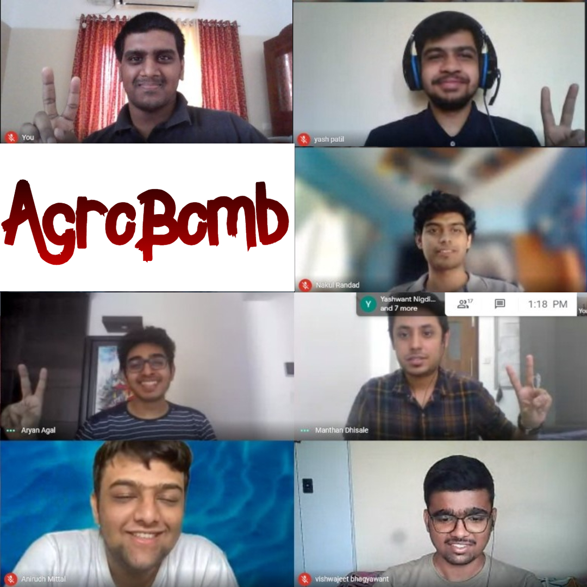

# Agrobot Design Innovation Challenge
## Rural Technology Action Group - North East (RuTAG-NE)

This repository is a collection of files including simulations, CAD models and documentation created by the IIT Bombay contingent for the Agrobot Design Innovation Challenge by RuTAG-NE for Inter-IIT Tech Meet 9.0 by IIT Guwahati.  

-----  

## Abstract  

North-East India has several favorable features for agriculture from fertile land to abundant water resources (high and dependable rainfall). It has a potential to utilize these optimally for agricultural productivity. We propose to design a cost-effective, eco-friendly, and easily operable agricultural robot to convert the incumbent but less effective subsistence farming into efficient mechanized farming by harnessing appropriate niche potentials of marginal mountain land. Our Agrobot deals in particular with effective braking in hilly terrains, transplantation of plants, seed metering, and weed removal, and we do suggest extra features that may supplement the needs of the farmer on an as-needed basis.  

-----  

## The Team  

But we miss Kaustubh and Jatin in the pic... Anirudh Mittal is the General Secretary - Technical Affairs, IIT Bombay (2020-21), and Aryan Agal and Manthan Dhisale are the Contingent Leaders of the IIT Bombay Contingent, Bombay76, for the 9th Inter-IIT Tech Meet.  

-----  
## Team Members

- [Nakul Randad](https://nakulrandad.github.io) *(Team Lead)* 
- [Aaron John Sabu](https://sites.google.com/view/aaronjs/)  
- [Vishwajeet Bhagyawant](https://vishwajeetiitb.github.io/) *(Team Lead)* 
- [Jatin Prashath](https://www.linkedin.com/in/jatin-prasath-399546183/)  
- [Yash Patil](https://www.linkedin.com/in/yash-patil-675863194/)  
- [Kaustubh Patil](https://www.linkedin.com/in/kaustubh-patil-04/)  

The contingent won Bronze Medal 🥉 in the RuTAG-NE Agrobot Design Innovation Challenge.
